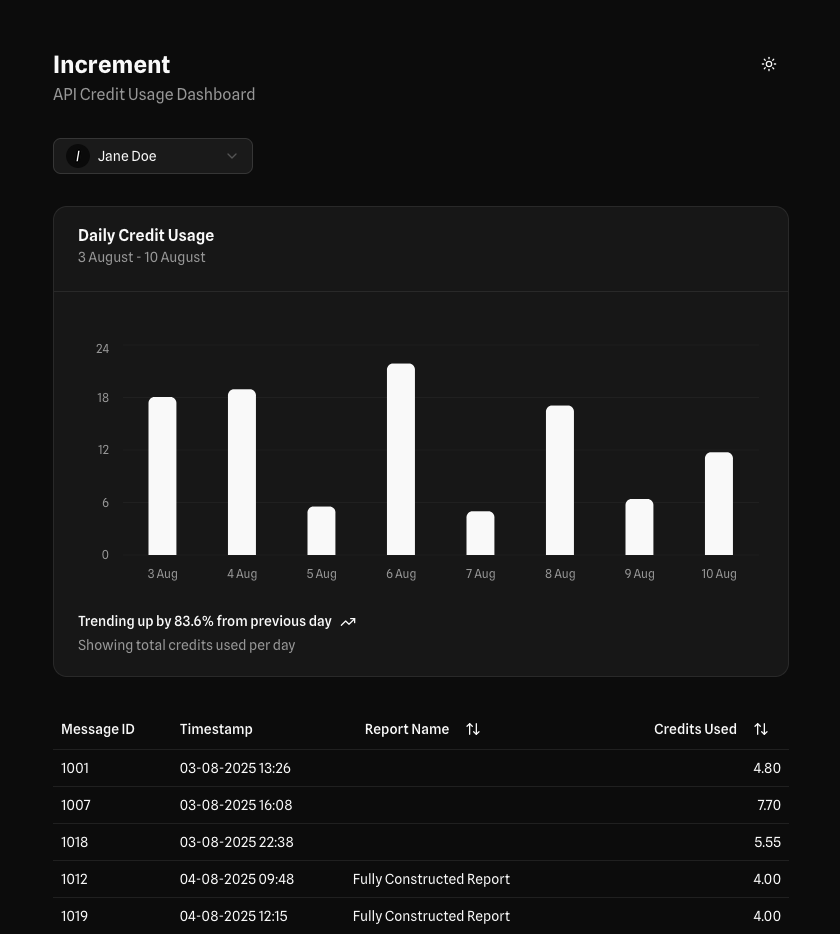

# Increment



Increment is a proof-of-concept LLM request cost estimation tool. It demonstrates rapid MVP development through pragmatic trade-offs and assumptions. Built using real data APIs and robust backend calculation logic, it helps developers and product managers predict the cost of using APIs for text-based AI interactions. The dashboard analyses input/output tokens to calculate potential costs, and provides visualisations and breakdowns of usage patterns. Currently, a demo, it shows key features such as interactive cost analysis charts, usage reports and predictive calculations based on historical data. The project emphasises practical development priorities - implementing core functionality and data handling while maintaining a foundation for future testing and scalability.

## Getting Started

## Frontend
Next.JS with shadcn for frontend

### Development

```bash
pnpm dev
```

Open [http://localhost:3000](http://localhost:3000) with your browser to see the result.

### Testing
Testing frontend with jest:

```bash
pnpm test
```

## Backend
Uses a separate Fast API app for backend [sotsugov/inc-api](https://github.com/sotsugov/inc-api)

